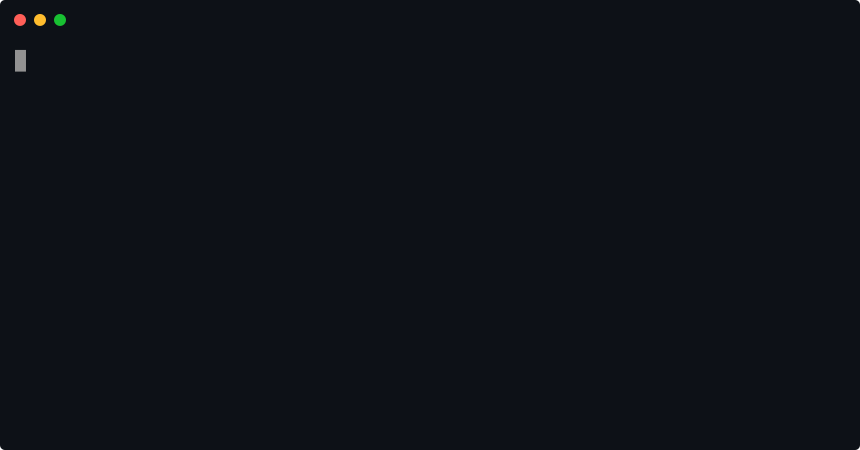

<p align="center">
  <a href="https://perchscan.com">
    <picture>
      <source media="(prefers-color-scheme: dark)" srcset=".github/logo.svg">
      
    </picture>
  </a>
</p>

<p align="center">
  <a href="https://www.npmjs.com/package/@lakeday/perch"></a>
  <a href="https://github.com/lakeday-org/perch/actions/workflows/ci.yml"></a>
  <a href="https://nodejs.org"></a>
  <a href="LICENSE"></a>
  <a href="https://perchscan.com"></a>
</p>

<p align="center">
  <a href="https://perchscan.com">perchscan.com</a> &nbsp;&middot;&nbsp;
  <a href="https://docs.perchscan.com">docs</a>
</p>

AST powered semantic code linting with Jev.



## Getting started

```sh
npm install -g @lakeday/perch
export TYPESAFE_API_KEY=...

perch scan                  # read the repository
perch issues                # what it found, worst first
perch issues 92c7781e       # open one up
perch check 92c7781e        # change it, ask again, nothing committed
```

## In your coding assistant

`perch setup` installs a skill that teaches it to scan what a branch changed, read the
JSON rather than the table, and treat a finding as a probability rather than a located
defect.

```sh
perch setup claude-code   # .claude/skills/perch/SKILL.md
perch setup codex         # .codex/skills/perch/SKILL.md
perch setup pi            # .pi/skills/perch/SKILL.md
perch setup cursor        # .cursor/rules/perch.mdc
```

Commit the file. [What it says](https://docs.perchscan.com/skill/).

## Semantic linting

Extend perch with your own rules, in `perch.yaml`:

```yaml
- name: env-read-once
  where: "src/**/*.js"
  each: method
  min: 70
  ensure: >
    This method does not read configuration out of process.env. Reading the
    environment is the command line's job.
```

They cover what a parser cannot prove. `perch scan` exits 3 when one breaks, so
CI can gate on it. [Every field](https://docs.perchscan.com/rules/).

## Documentation

[docs.perchscan.com](https://docs.perchscan.com)

| | |
| --- | --- |
| [Getting started](https://docs.perchscan.com/install/) | Install, the key, the first scan. |
| [Reading issues](https://docs.perchscan.com/issues/) | The list, the filters, closing what does not matter. |
| [Semantic linting](https://docs.perchscan.com/rules/) | Every field `perch.yaml` takes. |
| [Checking a change](https://docs.perchscan.com/check/) | `perch check` on work in progress. |
| [perch in CI](https://docs.perchscan.com/ci/) | What a build can gate on, and what it cannot. |
| [Command reference](https://docs.perchscan.com/cli/) | Every verb and every flag. |
| [How a scan works](https://docs.perchscan.com/scan/) | The graph walk, the questions, and how probabilities turn into a ranking. |

Results go in `.perch`. Nothing else is written to your tree.

## Development

```sh
npm run check     # lint, typecheck, test
npm run build     # bundle src/cli.js into dist/cli.mjs
```

From a checkout: `npm install && npm run build && npm link` puts `perch` on your
path.
